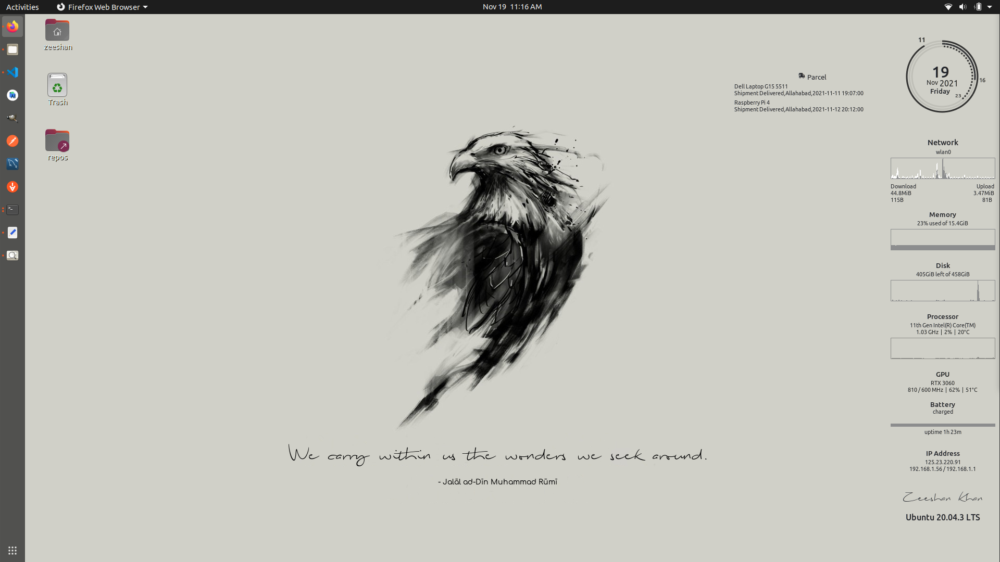

[Work in Progress]
# Install
 - clone this repo
 - run `./install`

# folder
 - sidebar - contains clock and system info
 - parcel - list current status of all parcels
 - quotes - downloads quotes from github gist and shows a one randomly

## Screenshot

